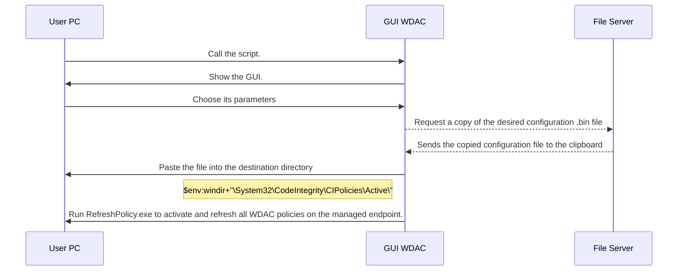

# Windows-WDAC-PowerShell-GUI

## Introduction
Script in PowerShell language providing a GUI to drive the native security utility WDAC (Windows Defender Application Control).

WDAC was introduced with Windows 10 and allows you to set an application control policy for code that runs in user mode, hardware and software drivers in kernel mode, and even code that runs within Windows.

Since the initial release of Windows 10, the world has witnessed numerous hacking and malware attacks where application control alone could have prevented the attack.

Controlling the drivers and programs running on a machine helps mitigate security threats by limiting the number of applications users are allowed to run and the code that runs in System Core.

WDAC is frequently referred to as one of the most effective ways to address
file-based executable malware threats (.exe, .dll, etc.).

Application control policies can also block unsigned scripts and MSI, and restrict Windows PowerShell from running in constrained language mode.

The following are Microsoft's recommended methods for deploying policies to PCs:
- MDM (Mobile Device Management)
- MEMCM (Microsoft Endpoint Configuration Manager)
- By using a script
- By using a group policy

## Design and management cycle of a strategy

In order to carry out this activity successfully, we rely on the Microsoft guide:
https://docs.microsoft.com/fr-fr/windows/security/threat-protection/windows-defender- application-control/
It should be understood that WDAC policies apply to the entire managed computer and affect all users of the device. WDAC policies can be defined based on the following data:
- Attributes of code certificates used to sign an application and its binaries
- Attributes of the application binaries that are derived from the signed metadata for the files, such as the original filename and version, or the hash of the
file
- Reputation of the application as determined by the intelligent Security Graph
- Identity of the process that initiated the installation of the application and its binaries
(managed installer)
- Path from which the application or file is launched (from Windows 10
versions 1903)
- Process that launched the application or binary file

A strategy is bound to evolve over time, it is necessary to be methodical and to plan the evolutions.
We start by defining the circle of trust, the strategy is established in "Audit" mode, this mode generates blocking events, but does not prevent the execution of files.

We monitor all blocking events and then adjust the strategy accordingly.
Once we have a suitable strategy, we change the mode of the strategy to "Applied".

How it works

## WDAC Policy Wizard

"WDAC Policy Wizard" is a utility developed by Microsoft that provides a graphical interface and allows system administrators to create application control policies ready for deployment.
It is quite possible to modify an existing policy or to merge several of them. 

This utility can be downloaded at the following link:
[https://webapp-wdac-wizard.azurewebsites.net/](https://webapp-wdac-wizard.azurewebsites.net/) Link valid as of: November 27 2022

### Configuration of the tool

An important element to take into account in order to avoid using additional command lines is the post-creation conversion of a strategy into binary. Indeed, by default, when a new strategy is generated, only a .XML file results.

However, this .XML file cannot be deployed, regardless of the method.

To do this, go to "Settings" and check the box "Convert policy to binary after xml creation".

### Creation of a strategy

Return to the home page, click on "Policy Creator" to create a new policy.

### Type of policy

Select the type of policy, in our case, we select the policy in Single Policy Format.
It is compatible with GPO deployment and works on all Windows 10, Windows Server 2016 and 2019.

### Strategy Model

Each of the policy models has a unique set of rules and a different circle of trust.

In our case, we select the "Default Windows Mode" model, which is the strictest model, it has the smallest circle of trust and therefore increased security.

However, it involves some background work of analysis and maintenance of the policy in order to adjust the circle to the proper functioning of the system.
Fill in the "Policy Name" field, in our case we name the policy ==XXXX_WDAC_Policy==.

Select the location of the policy via the field " Policy File Location ", in a dedicated directory, for exemple ==C:\Share\WDAC\==.

