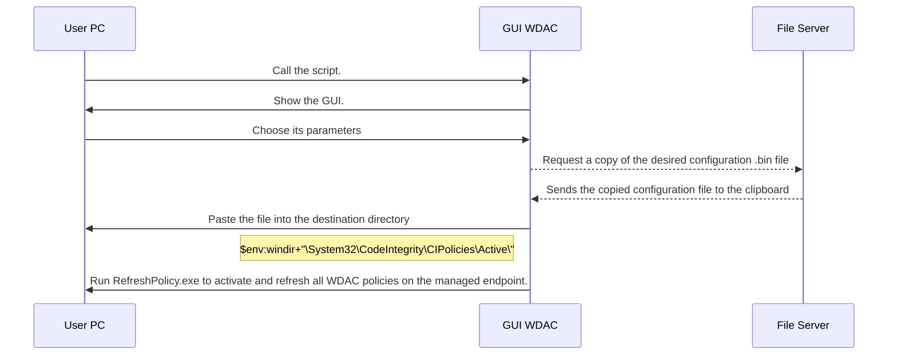

# Windows-WDAC-PowerShell-GUI

## Introduction
Script in PowerShell language providing a GUI to drive the native security utility WDAC (Windows Defender Application Control).

WDAC was introduced with Windows 10 and allows you to set an application control policy for code that runs in user mode, hardware and software drivers in kernel mode, and even code that runs within Windows.

Since the initial release of Windows 10, the world has witnessed numerous hacking and malware attacks where application control alone could have prevented the attack.

Controlling the drivers and programs running on a machine helps mitigate security threats by limiting the number of applications users are allowed to run and the code that runs in System Core.

WDAC is frequently referred to as one of the most effective ways to address
file-based executable malware threats (.exe, .dll, etc.).

Application control policies can also block unsigned scripts and MSI, and restrict Windows PowerShell from running in constrained language mode.

The following are Microsoft's recommended methods for deploying policies to PCs:
- MDM (Mobile Device Management)
- MEMCM (Microsoft Endpoint Configuration Manager)
- By using a script
- By using a group policy

# How it works


## Design and management cycle of a strategy

In order to carry out this activity successfully, we rely on the Microsoft guide:
https://docs.microsoft.com/fr-fr/windows/security/threat-protection/windows-defender- application-control/
It should be understood that WDAC policies apply to the entire managed computer and affect all users of the device. WDAC policies can be defined based on the following data:
- Attributes of code certificates used to sign an application and its binaries
- Attributes of the application binaries that are derived from the signed metadata for the files, such as the original filename and version, or the hash of the
file
- Reputation of the application as determined by the intelligent Security Graph
- Identity of the process that initiated the installation of the application and its binaries
(managed installer)
- Path from which the application or file is launched (from Windows 10
versions 1903)
- Process that launched the application or binary file

A strategy is bound to evolve over time, it is necessary to be methodical and to plan the evolutions.
We start by defining the circle of trust, the strategy is established in "Audit" mode, this mode generates blocking events, but does not prevent the execution of files.

We monitor all blocking events and then adjust the strategy accordingly.
Once we have a suitable strategy, we change the mode of the strategy to "Applied".


## WDAC Policy Wizard

"WDAC Policy Wizard" is a utility developed by Microsoft that provides a graphical interface and allows system administrators to create application control policies ready for deployment.
It is quite possible to modify an existing policy or to merge several of them. 

This utility can be downloaded at the following link:
[https://webapp-wdac-wizard.azurewebsites.net/](https://webapp-wdac-wizard.azurewebsites.net/) Link valid as of: November 27 2022


### Configuration of the tool

An important element to take into account in order to avoid using additional command lines is the post-creation conversion of a strategy into binary. Indeed, by default, when a new strategy is generated, only a .XML file results.

However, this .XML file cannot be deployed, regardless of the method.

To do this, go to "Settings" and check the box "Convert policy to binary after xml creation".


### Creation of a strategy

Return to the home page, click on "Policy Creator" to create a new policy.


### Type of policy

Select the type of policy, in our case, we select the policy in Single Policy Format.
It is compatible with GPO deployment and works on all Windows 10, Windows Server 2016 and 2019.


### Strategy Model

Each of the policy models has a unique set of rules and a different circle of trust.

In our case, we select the **"Default Windows Mode"** model, which is the strictest model, it has the smallest circle of trust and therefore increased security.

However, it involves some background work of analysis and maintenance of the policy in order to adjust the circle to the proper functioning of the system.
Fill in the "Policy Name" field, in our case we name the policy **XXXX_WDAC_Policy**.

Select the location of the policy via the field " Policy File Location ", in a dedicated directory, for exemple **C:\Share\WDAC**.


Policy rules are automatically enabled/disabled according to the chosen template.
We customize our rules according to our needs. 
The description of all options is summarized in the table below. To access all the options, click on "Advanced Options".


Define specific (complementary) rules for application identification. This identification can be done by:
- Editor name;
- Access path to the application's executable file or folder; Ø File attributes ;
- Name of the application ;
- File hash.


# Deployment of the WDAC strategy

We have already seen how to create a WDAC policy. The WDAC Policy Wizard utility allows you to create them graphically, but its function stops here.

To do this, you need to understand who WDAC is for. In any infrastructure, there are servers running Windows Server xxxx and desktops running Windows xx.

Each server is unique and has its own software.

It is therefore not possible to use a single strategy for all servers.

We dissociate these servers in "Profile".
We proceed to the creation of these profiles in our shared folder on the file server at the following address: **"\\\XXXXX\Share$\WDAC\"**

```
WDAC Root Directory in File Server
│   Script_GUI_WDAC.ps1  
│
└───Profiles
│   │
│   └───SNMP_Server
│   │   │   WDAC_Enforce.bin
│   │   │   WDAC_Enforce.xml
│   │   │   WDAC_Audit.bin
│   │   │   WDAC_Audit.xml
│   │
│   └───AD_Server
│       │   WDAC_Enforce.bin
│       │   WDAC_Enforce.xml
│       │   WDAC_Audit.bin
│       │   WDAC_Audit.xml
...
```
- The .XML file allows you to read and write these policies in order to adjust the settings. 
- The .BIN file allows you to deploy the policy on the computer so that Windows can apply it.

### GUI Interface

Our profiles, as well as our strategies are created, the PowerShell script that I created allows to modify the state of WDAC on the computer by using a GUI.

Scroll down the list, select the profile and choose the desired mode.

# Troubleshooting

# Define the location of profiles
```powershell

28  # Remote location containing profiles.
29  $Remote_Location_WDAC = "C:\Share\WDAC\Profiles\"

```

## Add or delete a rule manually

After having correctly associated the notion of Audit mode and Applied mode, it can sometimes happen that you simply want to authorize, block or delete a rule manually.

To do this, launch one of the .XML configuration files with a text editor.
In our example, we use the applied configuration file of the domain controller. We go to the end of the <FileRules> tag.
```xml
<FileRules>
     <Allow ID="ID_ALLOW_A_66A_0_0" FriendlyName="C:\Windows\regedit.exe" Hash= "cfc71e8a61c2c8e5f20281cd958a8c56a569d133d9781f130ea2a6382bbe507e" />
     <Allow ID="ID_ALLOW_A_66B_0_0" FriendlyName="C:\Windows\write.exe" Hash= "dbf47fb194796a8343cfbbf9ed44beaa87cd3a49a36c5c5ff1bd14d9e96cb2a4" />
     
We will add a rule allowing "WMIC", we increment the ID from the previous one. The ID is customizable, but logically, we increment from the previous one.
    <Allow ID="ID_DENY_A_66C_0_0" FriendlyName="wmic.exe" FileName="wmic.exe" MinimumFileVersion="0.0.0.0" MaximumFileVersion="65355.65355.65355.65355" />
</FileRules>

We report the mention at the end of the code to the <FileRulesRef> tag. It is used to load the previously written lines of code.
<FileRulesRef>
    <FileRuleRef RuleID="ID_ALLOW_A_66A_0_0" />
    <FileRuleRef RuleID="ID_ALLOW_A_66B_0_0" />    
    <FileRuleRef RuleID="ID_ALLOW_A_66C_0_0" />
</FileRulesRef>

Launch the WDAC GUI, put the workstation back in Audit mode and then Enforced in the same instance without having to reboot the machine between the two mode updates.
```
