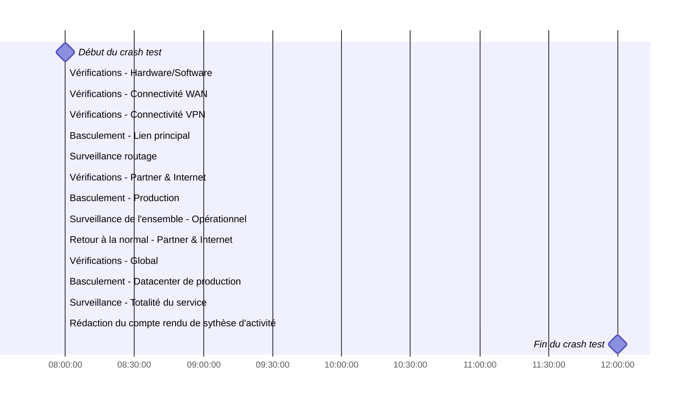

# Aspect organisationnel - Ordonnancement

```mermaid
gantt
dateFormat HH:mm
axisFormat %H:%M:%S
todayMarker off
Début du crash test : milestone, m1, 08:00, 0min
Vérifications - Hardware/Software : 30min
Vérifications - Connectivité WAN : 30min
Vérifications - Connectivité VPN : 30min
Basculement - Lien principal : 10min
Surveillance routage : 10min
Vérifications - Partner & Internet : 15min
Basculement - Production : 10min
Surveillance de l'ensemble - Opérationnel : 20min
Retour à la normal - Partner & Internet : 15min
Vérifications - Global : 15min
Basculement - Datacenter de production : 15min
Surveillance - Totalité du service : 20min 
Rédaction du compte rendu de sythèse d'activité : 20min
Fin du crash test : milestone, m2, 12:00, 0min
```
