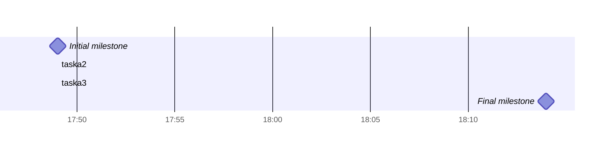

# Aspect organisationnel - Ordonnancement

```mermaid
gantt
dateFormat HH:mm
axisFormat %H:%M
Initial milestone : milestone, m1, 17:49,2min
taska2 : 10min
taska3 : 5min
Final milestone : milestone, m2, 18:14, 2min
```
gantt
        apple :a, 2017-07-20, 1w
        banana :crit, b, 2017-07-23, 1d
        cherry :active, c, after b a, 1d
